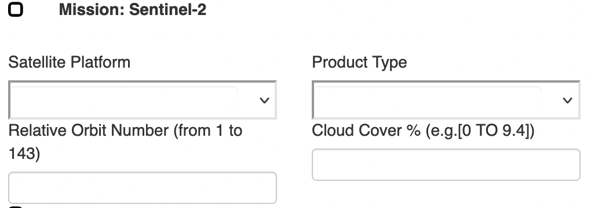

## GUIDELINE: HOW TO DOWNLOAD SENTINEL-2 IMAGES

### Table of Content

1. Download from ESA data hub using web interface
2. Copernicus Downloader

### 1. Downloand from ESA data hub using web interface.

To download Sentinel-2 images from [Copernicus ESA data hub](https://scihub.copernicus.eu/), you need to access to its website through this link : https://scihub.copernicus.eu/dhus/#/home

To be allowed to download any satellite images from Copernicus's program, you need to have account. For registering in  Copernicus Open Access Hub, you can use this form: https://scihub.copernicus.eu/dhus/#/self-registration.

Before download you need to prepare a list of available images by defining some parameters including:
1. satellite platform
2. product type
3. Relative Orbita Number
4. Cloud Cover %  

You also need to select the study area.

For more information for using graphical user interface you can refer to this page : https://scihub.copernicus.eu/userguide/GraphicalUserInterface

### 2. Copernicus Downloader

using the [Copernicus Downloader](Copernicus_downloader.py). 
To use this script, you need username and password explained before, and
run following code to install all required libraries 
``
pip install -r requirements.txt
``

Afterward, you need to change   satellite platform, Cloud Cover %  and sensing data inside the manuscript.

### 3. Downloading Sentinel-2 images using Google Earth Engine and Jupyter

What you need : 
1. Google account 
2. Install following libraries :
   - Jupter (More info: [https://jupyter.org/](https://jupyter.org/))
   - Google Earth engine API (To install it refer to this page : https://developers.google.com/earth-engine/guides/python_install)
   - GeeMAP for visualization and interacting with GEE API (More info: https://geemap.org/installation/)

After launching Jupyter notebook server, open [GEE_S2_PixelExtraction file](src/GEE_S2_PixelExtraction.ipynb), and follow instruction in notebook to download and extracting surface reflectance.  